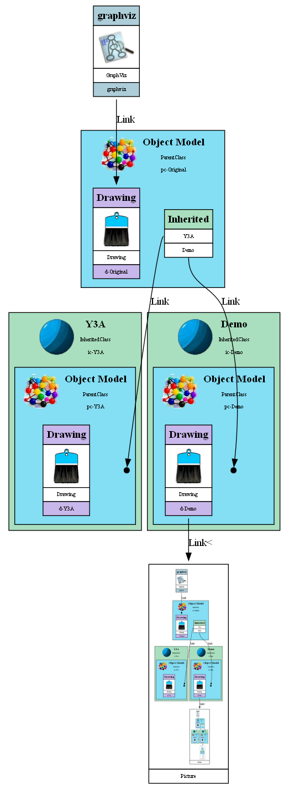

<div style="display: flex; justify-content: space-between; width: 1000px;">
    <div>
        <h1>Unified Infrastructure Management</h1>
    </div>
    <div>
        <!--  -->
    </div>
</div>
This repository comprises three interconnected projects that collectively empower users in managing, visualizing, and interacting with diverse infrastructures. 

<hr>

<div id="Yet_Another_AWS_Analyser" style="display: flex; justify-content: space-between; width: 1000px;">
    <div>
        <h2>Yet Another AWS Analyser</h1>
        <h3>Overview</h1>
    </div>
    <div>
        
    </div>
</div>

The [**Yet Another AWS Analyser**](docs/Yet_Another_AWS_Analyser.md) project extends the Object Model Framework to seamlessly incorporate AWS resources. Leveraging the Object Model Framework's dynamic class management, this project introduces specific AWS resource classes, enabling users to work with VPCs, subnets, RDS instances, AMIs, and other AWS entities in a unified manner.

### Key Features

- Unified Management:
    - Consistent interaction with AWS resources alongside user-defined classes.
    - Utilizes the dynamic instantiation and deletion methods of the [Object Model Framework](#Object_Model_Framework).
- Graph Visualization Enhancement:
    - Extends the graph visualization feature to support AWS objects.
    - Visualizes relationships between AWS objects, providing a clear representation of the AWS infrastructure.
    - Supported AWS Resource Categories:

```
`KeyPair`, `Vpc`, `SecurityGroup`, `SecurityGroupRule`, `InternetGateway`, `InternetGatewayAttachment`, `NetworkAcl`, `NetworkAclEntry`, `Subnet`, `RouteTable`, `Route`, `RouteTableAssociation`, `ElasticIP`, `NATGateway`, `ElasticIPAssociation`, `DBSubnetGroup`, `DBSubnetGroupSubnet`, `DBInstance`, `DynamoDB`, `User`, `Group`, `Role`, `Reservation`, `EC2`, `NetworkInterface`, `S3`, `SNS`, `Function`
```

The Yet Another AWS Analyser extends and utilizes the principles of the Object Model Framework. AWS-specific classes are seamlessly integrated into the broader class management framework.

For more details, refer to the [**Yet Another AWS Analyser**](docs/Yet_Another_AWS_Analyser.md) Readme.


<div id="Object_Model_Framework" style="display: flex; justify-content: space-between; width: 1000px;">
    <div>
        <h2>Object Model Framework</h1>
        <h3>Overview</h1>
    </div>
    <div>
        
    </div>
</div>

The [**Object Model Framework**](docs/Object_Model_Framework.md) is a foundational Python-based program that facilitates the creation, management, and visualization of a network of user-defined classes. Users can dynamically define classes, establish relationships between objects, and interact with external systems. [The Graph Drawing Utility](#Graph_Drawing_Utility) is employed for visualizing object relationships.

### Key Features

- Dynamic Object Creation:
    - Users can create classes and instances of those classes dynamically.
    - Integration with external systems for fetching data and managing objects.
- Graph as Code:
    - Visualizes objects and their relationships in a graph.
    - Supports owner, link, and list relationships between objects.
- External System Integration:
    - Seamless integration with external systems for data retrieval and object management.

For more details, refer to the [**Object Model Framework**](docs/Object_Model_Framework.md) Readme.


<div id="Graph_Drawing_Utility" style="display: flex; justify-content: space-between; width: 1000px;">
    <div>
        <h2>Graph Drawing Utility</h1>
        <h3>Overview</h1>
    </div>
    <div>
        
    </div>
</div>

The [**Graph Drawing Utility**](docs/Graph_Drawing_Utility.md) project provides a flexible tool for visualizing object relationships. This utility allows users to dynamically represent and explore connections between objects. With support for three relationship types (owner, link, and list), users can add, view, and establish relationships before rendering the object graph.

### Key Features

- Dynamic Object Addition:
    - Users can add objects to the graph dynamically.
- Viewing Objects:
    - Allows inspection of individual object details.
- Relationship Establishment:
    - Establishes relationships between objects with owner, link, and list types.
- Graph Rendering:
    - Renders the constructed object graph for visualization.

For more details, refer to the [**Graph Drawing Utility**](docs/Graph_Drawing_Utility.md) Readme.


## Example



## Links

| Yet Another AWS Analyser | Object Model Framework | Graph Drawing Utility |
| ------------------------ | ---------------------- | --------------------- |
| [](docs/Yet_Another_AWS_Analyser.md) | [](docs/Object_Model_Framework.md) | [](docs/Graph_Drawing_Utility.md) |
