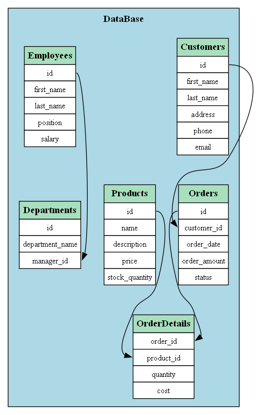

[ReadMe.md](..\ReadMe.md) \ [Graph Drawing Utility](Graph_Drawing_Utility.md)

<table style="width: 100%">
  <thead>
    <tr>
        <th>
            <h1>Graph Drawing Utility</h1>
        </th>
        <th>
            
        </th>
    </tr>
  </thead>
</table>

## Overview
The **Graph Drawing Utility** project provides a versatile tool for visualizing object relationships. This utility is designed to be seamlessly integrated into projects, allowing users to dynamically represent and explore the connections between objects.

## Adding objects
Users can add objects to the graph using the add_item method.

## Adding views
The item_view method provides a means to inspect the details of individual objects, facilitating a deeper understanding of the interconnected elements.
Relationship Establishment:

## Adding relations
Users can establish relationships between objects using three types:
add_parent: Defines an ownership relationship, clustering owned objects together.
add_link: Creates a connection between objects using arrows.

## Graph Rendering:
The utility enables users to visualize the constructed object graph, providing a clear representation of the established relationships.

## Example

[Source code](../GraphDemo.py)

## Links

| Read Me | Yet Another AWS Analyser | Object Model Framework | Graph Drawing Utility |
| ------------- | ------------------------ | ---------------------- | --------------------- |
|  |  |  |  |