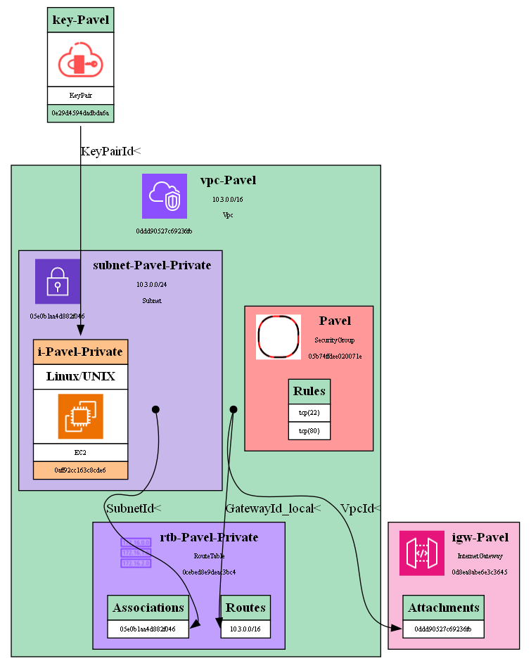
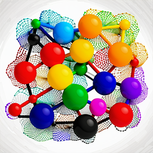

[ReadMe.md](../ReadMe.md) \ [Yet Another AWS Analyser](Yet_Another_AWS_Analyser.md)

<table style="width: 100%">
  <thead>
    <tr>
        <th>
            <h1>Yet Another AWS Analyser</h1>
        </th>
        <th>
            
        </th>
    </tr>
  </thead>
</table>

## Overview
The Yet Another AWS Analyser project extends the functionality of the [Object Model Framework](Object_Model_Framework.md) by incorporating a comprehensive set of AWS (Amazon Web Services) objects. This integration enables users to seamlessly manage, visualize, and interact with various AWS resources within the same framework.

## Key Features
- AWS Object Representation
    - The project introduces a set of AWS resource types, encapsulated as classes using the Object Model Framework.
- Unified Management
    - Users can create, retrieve, and delete AWS objects using the same principles established in the Object Model Framework. The integration allows for consistent interaction with AWS resources alongside user-defined classes.
- Graph Visualization Enhancement
    - The graph visualization feature of the Object Model Framework is extended to support AWS objects. Relationships between AWS objects are visualized, providing a clear representation of the AWS infrastructure.

## Supported AWS Resources

VPC Resources:
```
Vpc, KeyPairInfo
SecurityGroup, SecurityGroupRule
InternetGateway, InternetGatewayAttachment
NetworkAcl, NetworkAclEntry
```

SUBNET Resources:
```
Subnet
RouteTable, Route, RouteTableAssociation
ElasticIP
NATGateway, ElasticIPAssociation
```

RDS Resources:
```
DBSubnetGroup, DBSubnetGroupSubnet,
DBInstance,
DynamoDB
```

AMI Resources:
```
User, Group, Role
```

OTHER Resources:
```
Reservation
Instance
NetworkInterface
S3
SNS
Function (Lambda)
```

## Example

[Source code](../Examples/NYtask.py)



| Read Me       | Yet Another AWS Analyser | Object Model Framework | Graph Drawing Utility |
| ------------- | ------------------------ | ---------------------- | --------------------- |
| [](../ReadMe.md) | [](../docs/Yet_Another_AWS_Analyser.md) | [](../docs/Object_Model_Framework.md) | [](../docs/Graph_Drawing_Utility.md) |